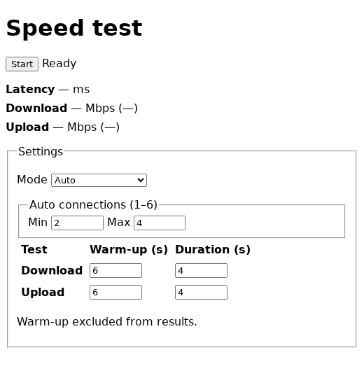

# Speedtest

Minimal browser-based latency, download, and upload test to your server.



## Run

```sh
docker run --rm -p 8080:8080 ghcr.io/sjtrny/speedtest:latest
```

Or with Docker Compose:

```yaml
services:
  speedtest:
    image: ghcr.io/sjtrny/speedtest:latest
    ports:
      - "8080:8080"
    restart: unless-stopped
```

```sh
docker compose up -d
```

Open <http://localhost:8080> and select **Start**.
